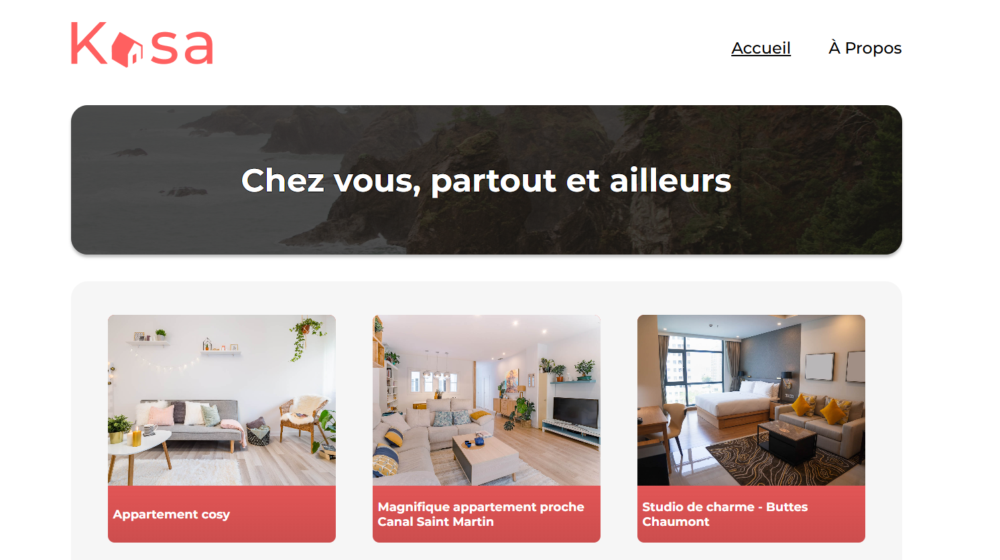

Site web Kasa

Ce dépôt correspond au projet 5 de la formation Développeur Web d'OpenClassrooms. 

Il consiste en la création d'une application web avec React.

Les objectifs étaient : 
- d'initialiser une application avec Create React App
- de configurer la navigation entre les pages de l'application avec React Router
- de développer des éléments de l'interface d'un site web grâce à des composants Reac
- de mettre en oeuvre des animations CSS
- de développer une interface web avec Sass

La technologie utilisée pour ce projet : 
- React
- React Router
- Sass Scss
- Yarn
- Git et GitHub pour le versionning

J'ai validé ce projet le 30 juillet 2024.

Les points forts de mes livrables : 
- bonne architecture
- fichiers jsx et scss présents pour chaques composants
- Router correctement installé
- composants réutilisables
- utilisations de hooks
- utilisation de props